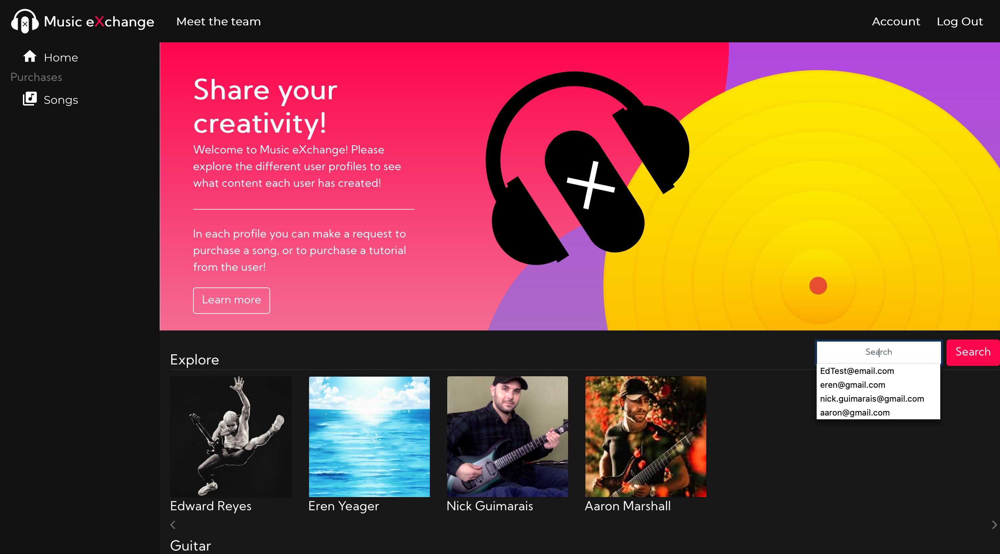
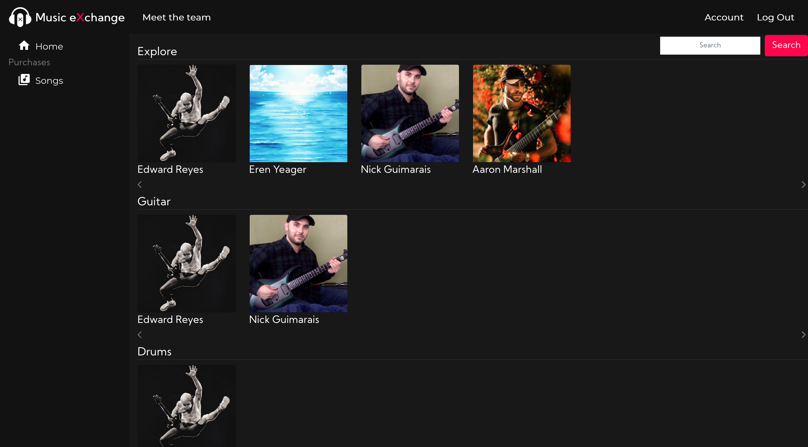
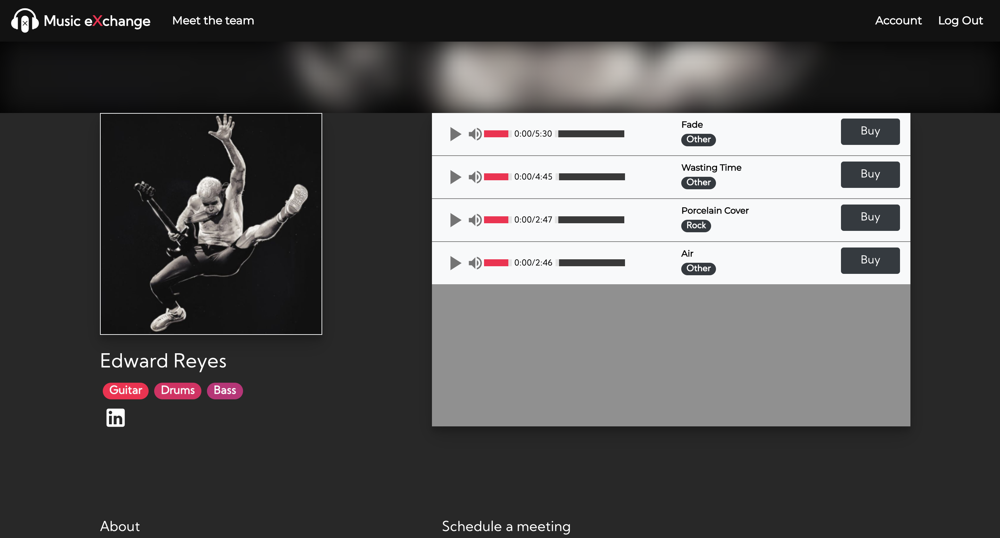

# Music eXchange 

## Authors
Nick Guimarais, Juhee Kim, Dustin Scroggins, Edward Reyes

[Visit our site](https://musicexchangev2.herokuapp.com/)


## Tables of Contents
* [Description](#description)
* [User-Story](#user-story)

* [Technologies](#technologies)

* [Contributions](#contributions)

* [Installation](#installation)

* [Issues](#issues)

* [Deployment](#Deployment)

## Description
This a MERN Stack e-commerce music app that allows users to upload their songs and videos and to share sell their music to other members. User's can manage their profile page by updating their profile picture, descriptions about themselves, adding social media links, and list instruments a member has experience with. Users who purchase other music can listen to all their purchased music on the home page. 

## User-Story
* I want an application that I can use to build a portfolio of music and offer my services to fans and anyone who wants to learn something for a fee. 

* As an artist or fan, I open the application and I am presented with a login screen to input my credentials.  As an artist, I will be directed to my profile management page.  As a fan, I will have the ability to search for an artist and and submit requests or purchase new material.

* When we look at an artist’s profile we are presented with a biography of information including contact information (determined by the artist or their management) and a list of songs for sale.  We are also presented with the ability to submit a request for a recorded tutorial and/or a live recording from the artist

* The artist receives the request from the user at which point they have the ability to negotiate their fee and book a time and date with the artist. 

* When a fee is determined, the artist will record their tutorial (either with youtube, or another video/production studio) and submit it directly to the user.

* The user will be notified that the artist has completed their request and the tutorial will be delivered when the fee has been processed.

* This program allows artists to have a direct relationship with their fans without the ability to perform live. 

## Technologies

### Frontend:
HTML, CSS, JavaScript, React Bootstrap, React, Parallax, Calendly, React Media Players, Material-UI

### Backend:
Node.js, Express, Mongo, Mongoose, Cloudinary

The uses localstorage for authentication. New user's have to sign in in order to view the app. In order to display videos and play music, the app implements react-media-player package. We are using the PayPal API to handle transactions. Transactions are in sandbox mode and not live, so no real transaction are taking place currently. To test this app you can create a PayPal sandbox account in order to finalize a demo transaction. In order to store audio files and images we are using Cloudinary. Every time a user uploads a profile picture or an audio file, it will be stored in Cloudinary and will return a link to the uploaded files. If users change their profile picture or delete an existing song, they will also be removed from Cloudinary as well by using cloudinary package in Node.js.

## Contributions

### Frontend
Juhee Kim, Dustin Scroggins
* Design landing page that allows users to input their login info
* Design the user profiles and artist profiles
* Design checkout area for song purchases/transactions
* Create a search bar that allows a user to search for any profile and navigate to that page. 
* Create media player to play demo songs, and songs purchased by the user. 
* Create front-end routes to submit forms and send requests to the backend

### Backend
Nick Guimarais, Edward Reyes

* Create HTML and API routes to visit user profiles, purchase songs, save favorite users, save songs, and create and save requests.
* Create User’s table that stores information for each user
* Create songs table and schema
* Create purchased songs array that stores the purchased songs
* Create table and schema for tutorials
* Create routes and controller functions to allow a user to edit their profile
* Creating search functionality to allow users to search for other users.
* Created the account page forms to update account information
* Used Cloudinary Node.js Package to upload audio and images and added functions to remove stored Cloudinary files dynamically.
* Used React-multi-carousel to display user by instrument.
* Used react-image-crop to allow users to crop their select profile picture, this was done to keep all profile styling consistent.
* Created the Songs page and media players to allow users to view their songs on their account, profile page, and home page. 
* Responsible for the styling and placement of all media players.
* Created Jumbotron images and logos using Adobe XD.

## Installation

To install the necessary dependencies:

```
npm i
```

## Issues
The music media player styling is not rendering properly in FireFox. It's works finr in FireFox when ran locally, but deploying to Heroku has in some way impacted some of the styling. We recommend using this app on Chrome just so users can see how the app is intended to look. Other than that, everything else works as intended in either browser.

## Deployment
Deployment link:
[Visit our site](https://musicexchangev2.herokuapp.com/)

Screenshots below are the current changes yet to be deployed

## View other Music eXchange Members

## Update your profile page to let others know more about you

## Crop your photo!

## Upload music to share with others

## Share your music videos and/or lessons 

## View member profiles and purchase their music



## PayPal


## Listen to purchased music whenever you want

## Say hi to the team!


## (!) Disclaimer
The music uploaded by Edward Reyes are his own work. But the any videos thus far are not. This app is a proof of concept first and foremost. We do not own any videos uploaded by other content users. Other's may upload music that are not theirs and again would be done for demonstration purposes. Any transactions are not official and we do not intend to make any transactions with other peoples work.

